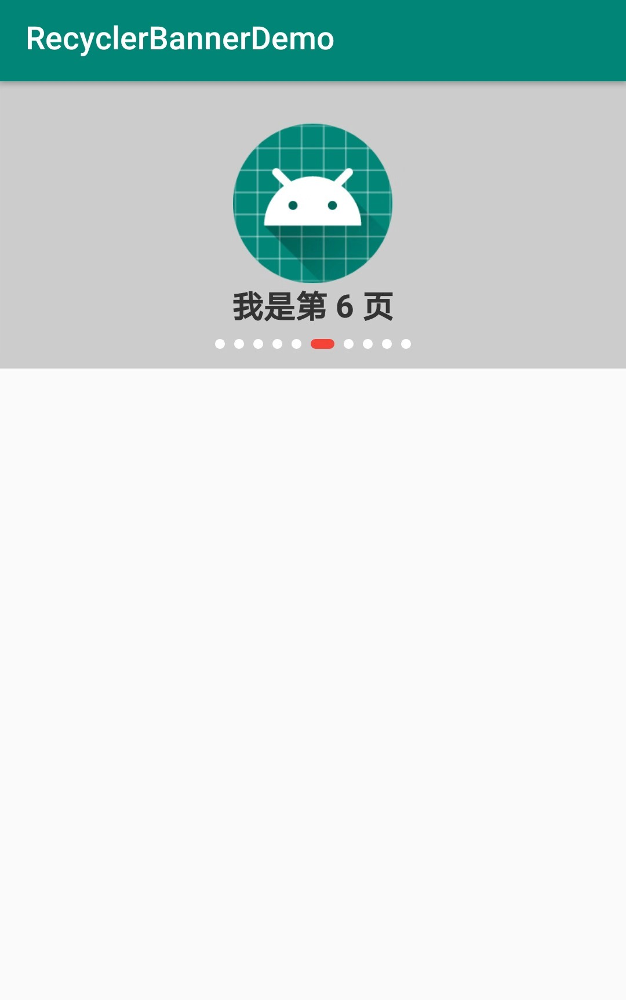

# RecyclerBanner
> 简介：
> 
> - RecyclerView 实现轮播图效果
> - 源码文件3个，只依赖 `implementation 'com.android.support:recyclerview-v7:28.0.0'`
> 

## 截图




## 使用方式

MainActivity.java

```
BannerAdapter bannerAdapter = new BannerAdapter();
banner.setAdapter(bannerAdapter);
List<String> data = getListData();
bannerAdapter.setData(data);
```

BannerAdapter.java

```
// LinearLayout 是 R.layout.view_banner_item 的最外层布局
// String 是数据集类型
public class BannerAdapter extends RecyclerBannerAdapter<LinearLayout, String> {

    @Override
    public LinearLayout onCreateBannerItem(ViewGroup parent) {
        return (LinearLayout) LayoutInflater.from(parent.getContext())
                .inflate(R.layout.view_banner_item, parent, false);
    }

    @Override
    public void onSetBannerItem(LinearLayout view, String bean) {
        TextView tv_txt = view.findViewById(R.id.tv_txt);
        tv_txt.setText(bean);
    }
}
```

## 推荐
- UltraViewPager: [https://github.com/alibaba/UltraViewPager](https://github.com/alibaba/UltraViewPager)（阿里天猫的轮播图，功能不多刚好够用）